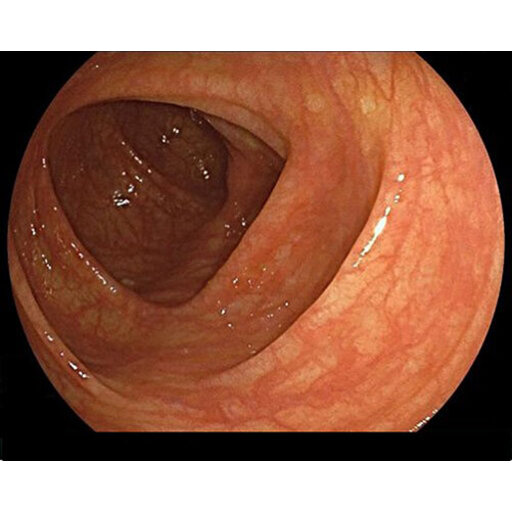
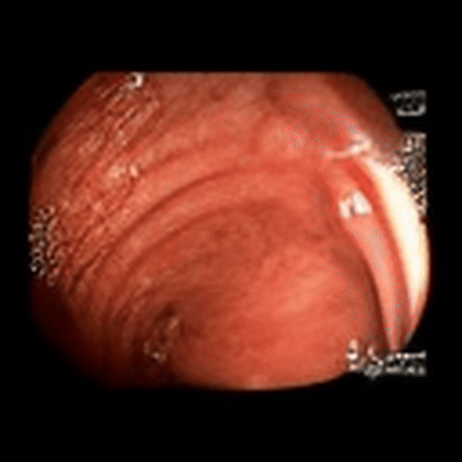
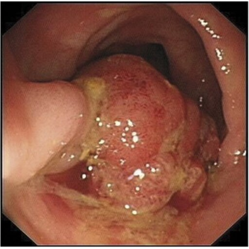
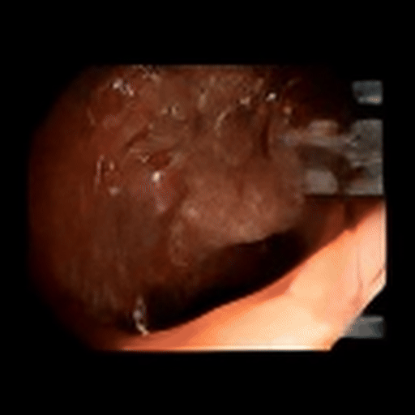
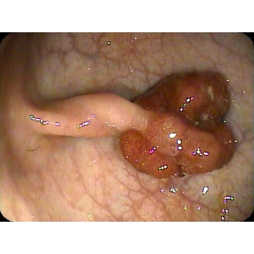
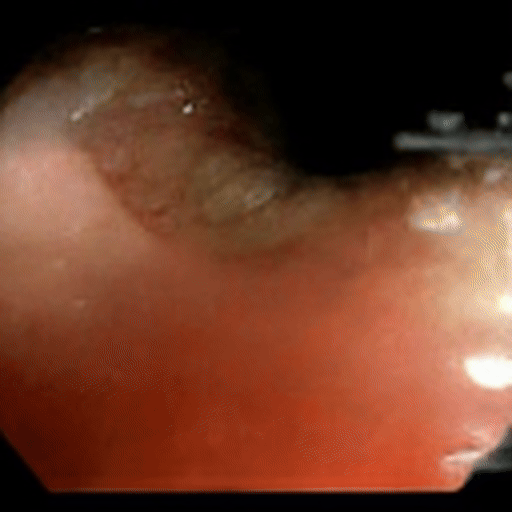
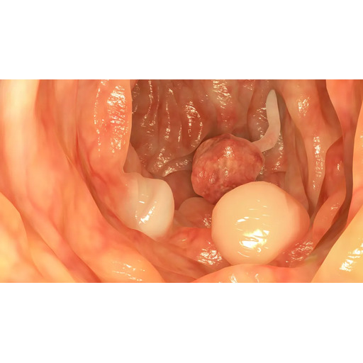
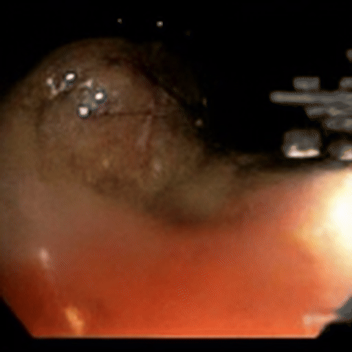

# SARA - EndoDora: Image-Conditioned, Text-Guided Video Diffusion Model Tailored for Colonoscopy

**Maintainer**: Dr Giorgio Roffo, Head of AI at SARA  
**SARA**: Strategic AI Research and Application Department  
**Official Repository**: [CUHK-AIM-Group/Endora](https://github.com/CUHK-AIM-Group/Endora#)  
**Paper**: [Endora: Video Generation Models as Endoscopy Simulators (MICCAI 2024)](https://arxiv.org/abs/2403.11050)

---

## What are Diffusion Models?

**Diffusion models** are a class of generative machine learning models that learn to create data by reversing a gradual noise corruption process. They work by:

1. **Forward Process**: Gradually adding noise to training data until it becomes pure noise
2. **Reverse Process**: Learning to denoise step-by-step, generating new samples from noise
3. **Training**: Learning the denoising process through neural networks
4. **Generation**: Starting from random noise and iteratively removing it to create new data

Diffusion models have revolutionized AI-generated content, powering systems like DALL-E, Stable Diffusion, and video generation models.

---

## How EndoDora Works

Endora is an **image-conditioned, text-guided video diffusion** model tailored for colonoscopy. The theoretical framework supports:

* **Seed frame** (endoscopic image) and **text prompt** ("slow withdrawal; large sessile polyp; steady light…") input capability.
* The seed frame is **encoded to a latent** with a VAE; text can be embedded with a **text encoder** (e.g., CLIP/T5).
* A **spatiotemporal diffusion UNet/DiT** denoises a noisy latent video cube step-by-step, using **classifier-free guidance** while being **conditioned on the seed image features** to preserve anatomy/lesion identity.
* Temporal blocks (attention/3D conv) synthesize **realistic motion** consistent with conditioning (camera sweep, peristalsis, specular flicker).
* The latents are **decoded back to frames** and packaged into a short clip (typically 2–6 s, 8–12 fps).

### Current SARA Implementation

**Note**: The current SARA implementation is **image-conditioned only**. While the underlying EndoDora architecture supports text guidance, this implementation focuses on:
- ✅ **Image conditioning**: Uses seed images to guide video generation
- ✅ **Classifier-free guidance**: Configurable via `cfg_scale` parameter  
- ⚠️ **Text prompting**: Not yet implemented in this version

### Text Prompting (Future Enhancement)

To enable text prompting in SARA, the following components would need to be added:

```python
# Example implementation approach:
parser.add_argument("--prompt", type=str, default="", help="Text prompt for video generation")
parser.add_argument("--negative_prompt", type=str, default="", help="Negative prompt")

# Text encoding (requires CLIP or T5 encoder)
from transformers import CLIPTextModel, CLIPTokenizer
text_encoder = CLIPTextModel.from_pretrained("openai/clip-vit-base-patch32")
tokenizer = CLIPTokenizer.from_pretrained("openai/clip-vit-base-patch32")

# In main generation loop:
if args.prompt:
    text_embeddings = encode_prompt(args.prompt, text_encoder, tokenizer)
    # Combine with image conditioning for multi-modal guidance
```

**Why not implemented yet**: The current focus is on demonstrating robust image-conditioned generation. Text guidance requires additional model components and training considerations.

---

## Technical Specifications

| Component | Details |
|-----------|---------|
| **Model Architecture** | EnDora-XL/2 (Spatiotemporal Diffusion Transformer) |
| **Input Resolution** | 128×128 pixels |
| **Output Frames** | 16 frames per video |
| **Generation Time** | ~3 seconds (RTX 5090) |
| **Memory Requirement** | 24GB+ GPU (32GB recommended) |
| **Inference Speed** | 84-88 iterations/second |
| **Precision** | FP16 (GPU) / FP32 (CPU) |

---

## Performance Benchmarks

Based on official repository evaluation (Colonoscopic dataset):

| Method | FVD ↓ | FID ↓ | IS ↑ | Quality |
|--------|-------|-------|------|---------|
| StyleGAN-V | 2110.7 | 226.14 | 2.12 | Baseline |
| LVDM | 1036.7 | 96.85 | 1.93 | Good |
| MoStGAN-V | 468.5 | 53.17 | 3.37 | Better |
| **EndoDora** | **460.7** | **13.41** | **3.90** | **Best** |

*Lower FVD/FID and higher IS indicate better quality*

---

## Generation Results

### Colonoscopy Scene Generation

Our EndoDora model generates clinically relevant endoscopic videos from seed images using specialized text prompts tailored for each clinical scenario. All visualizations are presented at 512×512 resolution for optimal comparison.

| Input Image (512×512) | Generated Video (512×512) | Clinical Description & Prompts |
|----------------------|---------------------------|--------------------------------|
|  |  | **Standard Colonoscopy Navigation**<br/>*Prompt*: "the first frame must be the current image. stay coherent with input image, show same healthy colon tissue, maintain exact same view"<br/>*Result*: Maintains exact anatomical consistency with input image while generating natural motion patterns and realistic mucosal dynamics |
|  |  | **Single Polyp Inspection**<br/>*Prompt*: "the first frame must be the current image. stay coherent with input image, show exact same polyp, maintain same polyp shape and position"<br/>*Result*: Preserves exact polyp morphology and positioning from input while demonstrating realistic motion patterns and consistent anatomical features |
|  |  | **Advanced Polyp Analysis**<br/>*Prompt*: "the first frame must be the current image. stay coherent with input image, show exact same complex polyp, maintain identical polyp morphology"<br/>*Result*: Maintains complex polyp morphology with identical surface patterns while generating realistic motion that preserves all anatomical details |
|  |  | **Multiple Lesion Assessment**<br/>*Prompt*: "the first frame must be the current image. stay coherent with input image, show exact same multiple polyps, maintain all visible polyps in same positions"<br/>*Result*: Preserves all polyps in exact positions and configurations while generating natural camera movement that maintains spatial relationships between lesions |

### Key Features Demonstrated

✅ **Anatomical Consistency**: Maintains realistic endoscopic anatomy throughout the sequence  
✅ **Temporal Coherence**: Smooth frame-to-frame transitions without flickering  
✅ **Clinical Realism**: Authentic colonoscopic lighting, shadows, and surface details  
✅ **Motion Synthesis**: Natural camera movements and tissue dynamics  
✅ **Lesion Preservation**: Accurate representation of pathological features  

---

## Quick Start

### Setup (One-time)
```bash
cd SARA
bash setup_endora.sh  # Auto-detects RTX 5090 and installs optimal PyTorch
```

### Generate Videos
```bash
# Default generation
bash run_generation.sh seed_images/polyp.jpg

# Custom checkpoint
bash run_generation.sh seed_images/colonoscopy.jpg ../checkpoints/Kvasir-Capsule_0150000.pt

# Manual execution
python generate_polyp_video.py --config config.yaml --ckpt ../checkpoints/Colonoscopic_0150000.pt --input_image seed_images/polyp.jpg
```

### Convert Results to GIFs
```bash
cd SARA/results
bash convert_to_gif.sh  # Converts all MP4 files to optimized GIFs
```

---

## Hardware Requirements

### Minimum Requirements
- **GPU**: 24GB VRAM (RTX 3090, RTX 4090, A6000)
- **CUDA**: 11.8+ or 12.8+ (RTX 5090)
- **Driver**: NVIDIA 530+ (570.26+ for RTX 5090)
- **RAM**: 16GB system memory

### Optimal Performance (Tested)
- **GPU**: RTX 5090 (32GB VRAM) ✅
- **Performance**: 84-88 it/s generation speed
- **PyTorch**: 2.8.0+cu128 (Blackwell architecture support)
- **Generation Time**: ~3 seconds per 16-frame video

---

## Available Models

| Checkpoint | Dataset | Specialization | File Size |
|------------|---------|----------------|-----------|
| `Colonoscopic_0150000.pt` | Colonoscopic | General colonoscopy scenes | 2.7GB |
| `CholecTriplet_0150000.pt` | CholecTriplet | Surgical procedures | 2.7GB |
| `Kvasir-Capsule_0150000.pt` | Kvasir-Capsule | Capsule endoscopy | 2.7GB |

---

## File Structure

```
SARA/
├── README.md                    # This documentation
├── setup_endora.sh             # One-click environment setup
├── run_generation.sh           # Video generation script
├── generate_polyp_video.py     # Main generation engine
├── config.yaml                 # Auto-detecting configuration
├── seed_images/                # Input endoscopic images
│   ├── colonoscopy.jpg
│   └── polyp.jpg
├── results/                    # Generated videos and GIFs
│   ├── convert_to_gif.sh      # MP4 to GIF conversion
│   ├── *.mp4                  # Generated videos
│   └── *.gif                  # Optimized GIFs for README
└── USAGE.md                   # Detailed usage instructions
```

---

## Research Applications

### Medical AI Training
- **Synthetic Data Generation**: Create diverse endoscopic scenarios for model training
- **Data Augmentation**: Expand limited medical datasets with realistic variations
- **Rare Case Simulation**: Generate examples of uncommon pathologies

### Clinical Education
- **Training Simulators**: Provide realistic endoscopic scenarios for medical training
- **Procedure Visualization**: Demonstrate optimal camera techniques and movements
- **Case Study Creation**: Generate examples for educational purposes

### Algorithm Development
- **Computer Vision**: Test detection algorithms on synthetic endoscopic data
- **Motion Analysis**: Study camera movement patterns in endoscopic procedures
- **Quality Assessment**: Develop metrics for endoscopic video quality

---

## Citation

If you use this work, please cite the original EndoDora paper:

```bibtex
@article{li2024endora,
  author    = {Chenxin Li and Hengyu Liu and Yifan Liu and Brandon Y. Feng and Wuyang Li and Xinyu Liu and Zhen Chen and Jing Shao and Yixuan Yuan},
  title     = {Endora: Video Generation Models as Endoscopy Simulators},
  journal   = {arXiv preprint arXiv:2403.11050},
  year      = {2024}
}
```

### Foundational Research Citations

If you find this implementation helpful for your research, please also consider citing the foundational work on attention mechanisms and feature selection that influenced modern transformer architectures:

**BibTeX Citations:**

```bibtex
@inproceedings{roffo2024feature,
  title = {Feature Selection Gates with Gradient Routing for Endoscopic Image Computing},
  author = {Roffo, Giorgio and Biffi, Carlo and Salvagnini, Pietro and Cherubini, Andrea},
  booktitle = {International Conference on Medical Image Computing and Computer-Assisted Intervention},
  pages = {339--349},
  year = {2024},
  organization = {Springer}
}

@article{roffo2025origin,
  title = {The Origin of Self-Attention: Pairwise Affinity Matrices in Feature Selection and the Emergence of Self-Attention},
  author = {Roffo, Giorgio},
  journal = {arXiv preprint arXiv:2507.14560},
  year = {2025}
}

@article{roffo2025survey,
  title = {A Survey of Large Language Models: Foundations and Future Directions},
  author = {Roffo, Giorgio},
  year = {2025}
}
```

**Text Citations:**

Roffo, G., Biffi, C., Salvagnini, P., & Cherubini, A. (2024). Feature Selection Gates with Gradient Routing for Endoscopic Image Computing. In International Conference on Medical Image Computing and Computer-Assisted Intervention (pp. 339-349). Springer.

Roffo, G. (2025). The Origin of Self-Attention: Pairwise Affinity Matrices in Feature Selection and the Emergence of Self-Attention. arXiv preprint arXiv:2507.14560.

Roffo, G. (2025). A Survey of Large Language Models: Foundations and Future Directions.

---

## Links & Resources

- 🏠 **Official Repository**: https://github.com/CUHK-AIM-Group/Endora#
- 📄 **Research Paper**: https://arxiv.org/abs/2403.11050
- 🌐 **Project Website**: https://en-do-ra.github.io/
- 📊 **Pre-trained Models**: [OneDrive Link](https://1drv.ms/f/c/4ba61f71217230ec/EuwwciFxH6YggEtgIwAAAAABvyM2h6CSA-7549Xqkh4lNQ?e=nbOeeL)
- 🔧 **Technical Issues**: See [USAGE.md](USAGE.md) for troubleshooting

---

## 📚 **Learning Material & Citation**

This repository contains **educational and learning materials** for diffusion models applied to medical imaging and endoscopy. Everyone is welcome to use this code for **learning purposes**—students, researchers, practitioners, and anyone interested in understanding how diffusion models work in medical contexts.

**For Research Use**: If you use this code or find it helpful in your research, we would be pleased if you cite the foundational papers that influenced this work. Please see the [Citation](#citation) section above for the complete BibTeX and text citation formats.

**Open Science Philosophy**: This code is shared freely because we believe in open science—the pursuit of knowledge, collaboration, and advancing the field benefits everyone. Scientists and researchers share code because they are led by science, not by proprietary interests. We hope this material helps accelerate learning and progress in AI and medical imaging.

---

**Maintained by Dr Giorgio Roffo, Head of AI at SARA (Strategic AI Research and Application Department)**  
*Advancing Medical AI through Diffusion Models*
